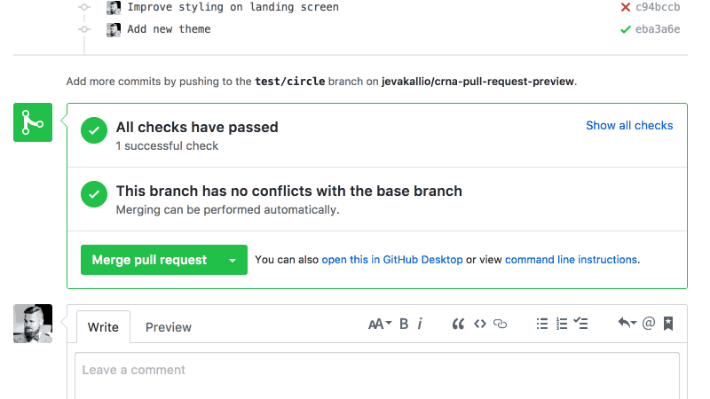

<h1 align="center">appr</h1>
<p align="center">
  <a title='License' href="https://raw.githubusercontent.com/FormidableLabs/appr/master/LICENSE" height="18">
    
  </a>
  <a href="https://badge.fury.io/js/appr">
    
  </a>
  <a href="https://travis-ci.org/FormidableLabs/appr">
    
  </a>
   <a href="https://github.com/FormidableLabs/appr#maintenance-status">
    
  </a>                                                                                             
</p>

<h4 align="center">
  Automatically Deploy Pull Requests for Create React Native App and Expo
</h4>
<p align="center">
  </img>
</p>

---

**appr builds and deploys pull requests** in your [create-react-native-app](https://github.com/react-community/create-react-native-app) (and other [Expo](https://expo.io/)-based) projects, and replies with a link you can open directly on your device or emulator.

## Compatibility warning :warning:

As of [Expo SDK 26, the Expo iOS client is no longer able to open QR codes due to Apple App Store limitations](https://blog.expo.io/upcoming-limitations-to-ios-expo-client-8076d01aee1a). We are investigating on how to adapt appr to work with newer version of Expo iOS. In the meantime, appr only works for Android testing workflows and Expo SDK versions 25 and older on iOS.

## Etymology /ɛtɪˈmɒlədʒi/

### appr /ˈapə/

_noun_

* **appr** - Pull Request Review Apps for React Native
* **appr** - Portmanteaux of _app_ and _PR_.
* **appr** - Throwback to Web 2.0, when everything was bettr

## What are "Review Apps"?

Mature technical organizations peer-review their code. Reviewing code on GitHub is simple enough: for most well-crafted pull requests, you can review the code diff in your browser, and either approve the changes, or request further improvements.

Testing another developer's changes isn't quite as easy. Typically, you will have to stash any work in progress in your own workspace, pull down the remote branch, install dependencies, compile and start the application before you can verify that the changes work as intended.

Since it was launched, I've loved Heroku's GitHub-integrated [Review Apps](https://devcenter.heroku.com/articles/github-integration-review-apps). As part of your branch build, Heroku will spin up a new review instance of your application, which you can then access with a direct link from your GitHub pull request. [Netlify](https://www.netlify.com/) offers the same functionality for deploying static websites.

Unfortunately, a one-click workflow like this doesn't exist for mobile development. To add insult to injury, the ramp-up time to test mobile app changes on your local device can be much longer than for web applications.

Enter **appr**. Built on [Expo](https://expo.io) and inspired by [Expo Sketch](https://sketch.expo.io), **appr** aims to make peer-reviewing React Native app code as easy as static websites. **appr** creates a new [Expo Release Channel](https://docs.expo.io/versions/latest/guides/release-channels.html) for every PR or branch you enable it on and automatically pushes your code to the release channel on every change.

## Getting started

Add `appr` and `exp` to your project.

```sh
  yarn add --dev appr exp
```

Or, using npm:

```sh
  npm install --dev appr exp
```

`exp`, the Expo CLI, is a required peer dependency. In versions `1.x` of appr it was installed by default, so if your'e upgrading to `appr@2.x`, please install `exp` manually.

Add the `appr` task to the `scripts` section of your package.json:

```diff
  scripts: {
+   "appr": "appr",
  }
```

Next, configure one of the currently supported CI environments:

* [Configuring Travis](#configuring-travis)
* [Configuring Circle CI](#configuring-circle-ci)
* [All other CIs](#configuring-other-cis)

[Contributions](#contributing) for other CI platforms welcome.

## Limitations

There are a few limitations you should be aware of. **appr** is currently not able to deploy:

1.  React Native apps started with something other than create-react-native-app or Expo.
2.  Ejected React Native apps containing custom native module dependencies.
3.  Pull Requests from forked repositories. This is due to Travis and Circle security policies (wisely) not exposing secure environment variables to forked builds. (Circle CI allows you to disable this setting, but it is not recommended!)

[Contributions](#contributing) and ideas for solutions welcome.

## Configuring Travis

[Travis CI](https://travis-ci.org) is free for open source projects, and offers paid plans for private repositories. To get started, create an account on Travis using your GitHub login.

#### Add .travis.yml to your project

Add the following to your `.travis.yml`:

```yml
language: node_js
node_js:
  - "node"
cache: yarn
script:
  - 'if [ "$TRAVIS_PULL_REQUEST" != "false" ]; then yarn appr; fi'
```

This will configure your Travis build to use the latest Node.js and Yarn, and ensure that the **appr** build only runs on Pull Request builds.

#### (Optional) Pushing non-PR branches

You may also want to automatically push some target branches, e.g. your `develop` or `master` branches to a release channel to test your integrated code. In that case, you can whitelist the branches to release in your `.travis.yml`:

```yml
script:
  - 'if [ "$TRAVIS_PULL_REQUEST" != "false" ] || [ "$TRAVIS_BRANCH" == "master" ]; then yarn appr; fi'
```

#### (Optional) Running tests

It's advisable to run your unit tests before deploying review apps. You can do this by adding other steps in the `script` section, and always leaving the **appr** step last:

```diff
script:
+ - yarn ci-test-command
  - 'if [ "$TRAVIS_PULL_REQUEST" != "false" ]; then yarn appr; fi'
```

Note that the default `test` command in `create-react-native-app` runs Jest in `--watch` mode, which will hang forever. You can either change the `test` script in your package.json, or, or override the test command as above.

#### Enable Travis

The final step is to enable [Travis CI](https://travis-ci.org) on your repository. Log into your Travis account, and turn on the build for your project in your Profile.

After enabled, you'll be taken to your project build page. Before triggering the first build, you'll need to add a few secure environment variables to your build under `More options > Settings`:

* `EXP_USERNAME` - Exponent username, under which to publish the review apps. Use your main account, or create a new one for review apps. All review apps will be unlisted, so only you can see them in your app listings.
* `EXP_PASSWORD` - Exponent password for the publish user.
* `GITHUB_USERNAME` - A user account you want to use for posting the review app links. Use your own, or create a new "bot" account and grant them access to your repo.
* `GITHUB_TOKEN` - A [Personal API Token](https://github.com/blog/1509-personal-api-tokens) of the user with access to the repository. If the repository is private, the token needs to be granted the full `repo` scope. For public repositories, the `public_repo` scope is enough.

#### Test it

You should now be able to create a new branch, make changes, and open a pull request. If the stars are aligned, the Travis build should publish the app to Expo!

## Configuring Circle CI

[Circle CI](https://circleci.com) offers one free build container for public and private repositories. To get started, create an account on Circle CI using your GitHub login.

#### Add circle.yml to your project

Add the following to your `circle.yml`:

```yml
dependencies:
  override:
    - yarn
machine:
  node:
    version: 6.9
deployment:
  appr:
    branch: /.*/
    commands:
      - 'if [ "$CI_PULL_REQUEST" != "" ]; then yarn appr; fi'
```

This will configure your Circle build to use the latest Node.js and Yarn (optional), and ensure that the **appr** build only runs on Pull Request builds.

#### (Optional) Pushing non-PR branches

You may also want to automatically push some target branches, e.g. your `develop` or `master` branches to a release channel to test your integrated code. In that case, you can whitelist the branches to release in your `circle.yml`:

```yml
deployment:
  appr:
    branch: /.*/
    commands:
      - 'if [ "$CI_PULL_REQUEST" != "" ] || [ "$CIRCLE_BRANCH" == "master" ]; then yarn appr; fi'
```

#### (Optional) Running tests

Circle CI will automatically run your tests before the deployment. Note that the default `test` command in `create-react-native-app` runs Jest in `--watch` mode, which will hang forever. You can either change the
`test` script in your package.json, or, or override the test command in circle.yml:

```yml
test:
  override:
    - yarn ci-test-command
```

#### Enable Circle CI

The final step is to enable [Circl CI](https://circleci.com) on your repository. Log into your Circle CI account, and [turn on the build for your project](https://circleci.com/add-projects).

After enabled, you'll be taken to your project build page. Before triggering the first build, you'll need to add a few secure environment variables to your build under `[Gear icon] > Settings > Environment variables`:

* `EXP_USERNAME` - Exponent username, under which to publish the review apps. Use your main account, or create a new one for review apps. All review apps will be unlisted, so only you can see them in your app listings.
* `EXP_PASSWORD` - Exponent password for the publish user.
* `GITHUB_USERNAME` - A user account you want to use for posting the review app links. Use your own, or create a new "bot" account and grant them access to your repo.
* `GITHUB_TOKEN` - A [Personal API Token](https://github.com/blog/1509-personal-api-tokens) of the user with access to the repository. If the repository is private, the token needs to be granted the full `repo` scope. For public repositories, the `public_repo` scope is enough.

Optionally, you can enable `Advanced settings > Only build pull requests` to avoid running build on branches that do not have open pull requests.

#### Test it

You should now be able to create a new branch, make changes, and open a pull request. If the stars are aligned, the Circle CI build should publish the app to Expo!

## Configuring other CIs

If your preferred CI is not explicitly supported by _appr_, but supports building GitHub pull requests,
you can use it by [defining environment variables as shown in the default config file](scripts/config/default.js).

## Contributing

Improvements and additions welcome. For large changes, please submit a discussion issue before jumping to coding; we'd hate you to waste the effort.

In lieu of a formal style guide, follow the included eslint rules, and use [Prettier](https://github.com/prettier/prettier) to format your code.

### Maintenance Status

**Archived:** This project is no longer maintained by Formidable. We are no longer responding to issues or pull requests unless they relate to security concerns. We encourage interested developers to fork this project and make it their own!
